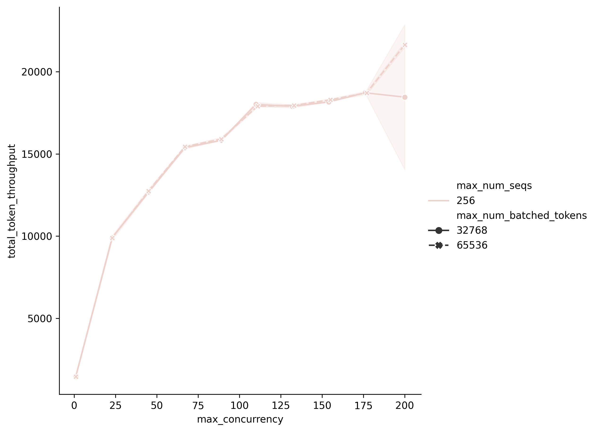
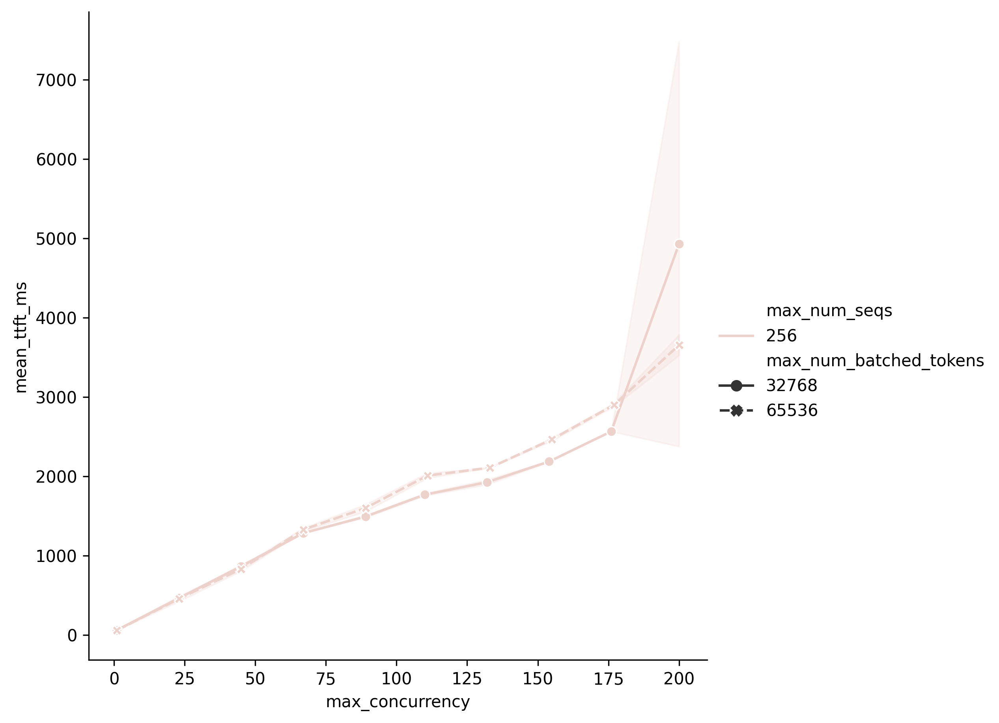

# vLLM tunning

## Chiến lược chung

Để tránh lượng benchmark khổng lồ (tích Descartes) giữa bench params và serve params, ta sẽ cố định bench param và tunning serve param bằng `vllm bench sweep.` Sau đó chọn top cấu hình serve để tìm workload hợp lí bằng `vllm bench sweep serve_workload`

## Các bước thực hiện

1. Chọn tập nhỏ cấu hình benchmark [bench_params.json](./qwen36_rtx6000pro_prefill_heavy/bench_params.json) (có thể từ 1 - 2 sample).
Đưa ra các cấu hình khả thi cho [serve_params.json](./qwen36_rtx6000pro_prefill_heavy/serve_params.json) và chạy [bench_serve.sh](./qwen36_rtx6000pro_prefill_heavy/bench_serve.sh)

2. Quan sát dữ liệu benchmark và đặc biệt là biểu đổ [Pareto](./qwen36_rtx6000pro_prefill_heavy/results/all/viz/PARETO.png) để tìm cấu hình hợp lí.

```bash
$ bash plot.sh ./qwen36_rtx6000pro_prefill_heavy/results/all
```

3. Lấy top cấu hình serve và đặt vào [top_configs.json](./qwen36_rtx6000pro_prefill_heavy/top_configs.json). Sau đó tiến hành tunning max concurreny

```bash
$ bash ./qwen36_rtx6000pro_prefill_heavy/bench_serve_workload.sh
```

4. Quan sát dữ liệu benchmark để chọn workload hợp lí (tradoff giữa thoughput và TTFT, TOPS và độ ổn định)

```bash
bash ./plot_serve_workload.sh ./qwen36_rtx6000pro_prefill_heavy/results/workload
```

## Phân tích mẫu

Cấu hình serve đã chọn:
```json
[
    {
        "_benchmark_name": "s02",
        "max_num_seqs": 256,
        "max_num_batched_tokens": 32768
      },
      {
        "_benchmark_name": "s03",
        "max_num_seqs": 256,
        "max_num_batched_tokens": 65536
      }
]
```


Như trong hình là 2 biểu đồ giữa max conccurency - token thoughput và TTFT



**Nhận xét**

1. Max conccurency từ 1 - 75 là điểm chưa bão hòa do thoughput và TTFT vẫn tương quan mạnh
2. Từ 176 trở đi, tuy thoughtput tăng nhưng TTFT tăng mạnh (có thể tradoff). Tuy nhiên, còn 1 điểm là ở vùng này, độ biến thiên lớn --> không ổn định SLA.
3. Có thể chọn max conccurency trong vùng từ 80 - 150 để làm SLA.

**Một số lưu ý**

- max_num_seqs: là số lượng request được xử lí đồng thời (nếu token budget còn). Cấu hình này chủ yếu làm tăng số lượng request được decoding, dẫn tới memory bound (chứng minh là con số này trên H100 nhỏ hơn RTX 6000 Pro do VRAM trên RTX 6000 Pro lớn hơn H100)

- max_num_batch_tokens: là số token được xử lí trong 1 iteration, liên quan trực tiếp tới khả năng tính toán của GPU (chứng minh là trên H100, con số này lớn hơn RTX 6000 Pro do số Tensor core của H100 lớn hơn).
